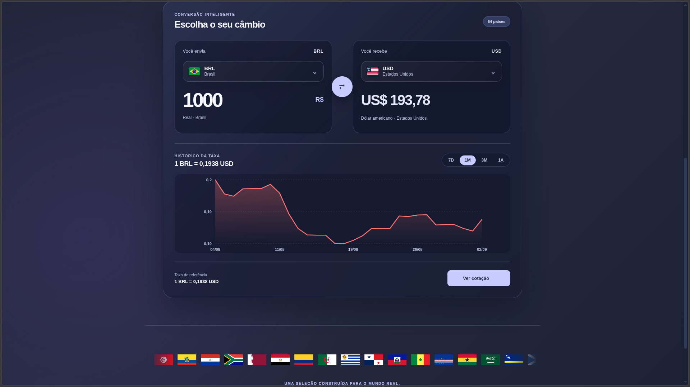

# câmbio64

Conversor de moedas interativo desenvolvido com React, TypeScript e Vite. Permite comparar moedas de 64 países, consultar taxas de câmbio atualizadas e acompanhar a variação histórica da cotação em um gráfico interativo.

**Demo:** [cambio64.netlify.app](https://cambio64.netlify.app/)

[](https://react.dev/)
[](https://www.typescriptlang.org/)
[](https://vite.dev/)
[](https://cambio64.netlify.app/)

## Sumário

- [Sobre o projeto](#sobre-o-projeto)
- [Funcionalidades](#funcionalidades)
- [Tecnologias utilizadas](#tecnologias-utilizadas)
- [Estrutura do projeto](#estrutura-do-projeto)
- [Como executar localmente](#como-executar-localmente)
- [Scripts disponíveis](#scripts-disponíveis)
- [Build de produção](#build-de-produção)
- [Deploy no Netlify](#deploy-no-netlify)
- [Fonte de dados](#fonte-de-dados)
- [Possíveis melhorias futuras](#possíveis-melhorias-futuras)
- [Autor](#autor)

## Sobre o projeto

O câmbio64 permite escolher uma moeda de origem e uma de destino, informar um valor e visualizar a conversão calculada em tempo real. Um gráfico interativo mostra a variação histórica da taxa entre as duas moedas, com opções de período de 7 dias, 1 mês, 3 meses e 1 ano.



## Funcionalidades

- Conversão entre moedas de 64 países
- Taxas de câmbio atualizadas via API
- Gráfico histórico da taxa de câmbio, com períodos de 7 dias, 1 mês, 3 meses e 1 ano
- Tooltip no gráfico com data e valor exato da cotação em cada ponto
- Navegação do gráfico pelo teclado (setas esquerda/direita) e por toque
- Seletor de moeda personalizado, com bandeiras e busca por país, código ou nome da moeda
- Botão para inverter rapidamente as moedas selecionadas (origem ↔ destino)
- Animação contínua com as bandeiras de todos os países disponíveis
- Cache local (localStorage) das últimas taxas válidas, para manter a experiência estável mesmo se a API estiver indisponível
- Interface responsiva, adaptada para computador e celular

## Tecnologias utilizadas

- [React 19](https://react.dev/)
- [TypeScript](https://www.typescriptlang.org/)
- [Vite](https://vite.dev/)
- CSS puro, sem frameworks de estilo
- [Oxlint](https://oxc.rs/) para lint do código
- [Frankfurter API](https://frankfurter.dev/) para as taxas de câmbio (atuais e históricas)

## Estrutura do projeto

```text
currency-converter/
├── public/
│   ├── flags/          # Bandeiras dos 64 países disponíveis
│   ├── favicon.svg
│   └── icons.svg
├── src/
│   ├── assets/          # Imagens usadas na interface
│   ├── data/
│   │   └── currencies.ts   # Lista de moedas, países e bandeiras
│   ├── App.tsx           # Componente principal: conversor, dropdown e gráfico
│   ├── App.css
│   ├── index.css
│   └── main.tsx
├── package.json
├── tsconfig.json
└── vite.config.ts
```

## Como executar localmente

### Pré-requisitos

- [Node.js](https://nodejs.org/) 18 ou superior
- npm

### Passo a passo

Clone o repositório:

```bash
git clone https://github.com/Asapx380/currency-converter.git
```

Entre na pasta do projeto:

```bash
cd currency-converter
```

Instale as dependências:

```bash
npm install
```

Inicie o ambiente de desenvolvimento:

```bash
npm run dev
```

Abra a URL exibida pelo Vite no navegador. Normalmente:

```text
http://localhost:5173
```

## Scripts disponíveis

| Script            | Descrição                                      |
| ------------------ | ----------------------------------------------- |
| `npm run dev`     | Inicia o servidor de desenvolvimento com hot reload |
| `npm run build`   | Gera a versão de produção na pasta `dist`       |
| `npm run lint`    | Executa o Oxlint sobre o código                 |
| `npm run preview` | Serve localmente a build de produção            |

## Build de produção

```bash
npm run build
```

Os arquivos finais são gerados na pasta `dist`, prontos para deploy em qualquer serviço de hospedagem de sites estáticos.

## Deploy no Netlify

1. Envie o projeto para o GitHub.
2. No Netlify, escolha **Add new site** e depois **Import an existing project**.
3. Conecte sua conta do GitHub e selecione o repositório `currency-converter`.
4. Use estas configurações de build:

```text
Build command: npm run build
Publish directory: dist
```

5. Clique em **Deploy site**.

## Fonte de dados

As taxas de câmbio (atuais e históricas) são obtidas em tempo real através da [Frankfurter API](https://frankfurter.dev/), uma API gratuita e de código aberto baseada nos dados do Banco Central Europeu. Caso a API esteja indisponível, o aplicativo utiliza a última taxa válida salva no navegador (localStorage).

## Possíveis melhorias futuras

- Adicionar testes automatizados (unitários e de interface)
- Permitir favoritar pares de moedas usados com frequência
- Exportar o histórico de conversão em CSV
- Suporte a modo claro, além do tema atual

## Autor

Desenvolvido por [Wesley Luther](https://github.com/Asapx380).

- GitHub: [@Asapx380](https://github.com/Asapx380)
- LinkedIn: [wesley-luther](https://linkedin.com/in/wesley-luther)